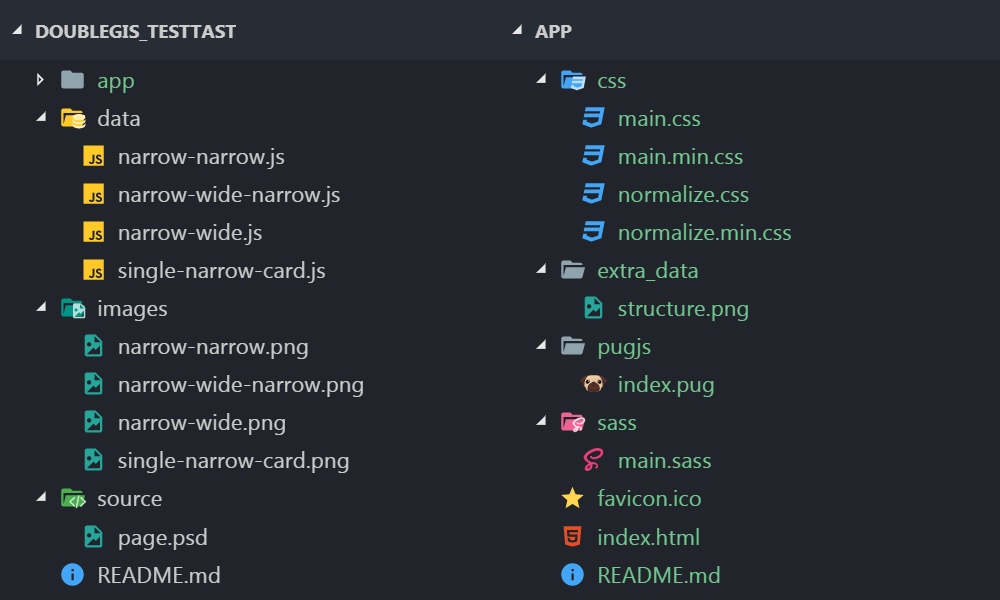

# Тестовое задание от 2Gis

* [Структура](#Структура)
* [Изменения](#Изменения)
* [TODO](#TODO)

## Структура

```
/doubleGis_testTast
├── app   // Каталог выполненого задания
|   ├── css
|   |   ├── main.css   // Исходники стилей в CSS
|   |   ├── main.min.css   // Минифицированные стили
|   |   ├── normalize.css   // Сброс стилей - normalize v8.0.0
|   |   └── normalize.min.css   // Минифицированный сброс
|   ├── extra_data   // Скриншоты, описание выполнения
|   ├── pugjs
|   |   └── index.pug   // Исходники разметки в PUG
|   ├── sass
|   |   └── main.sass   // Исходники стилей в SASS
|   ├── favicon.ico
|   ├── index.html
|   └── README.md   // Описание выполнения задания
├── data   // Массивы с карточками в JSON
|   ├── narrow-narrow.png
|   ├── narrow-wide-narrow.png
|   ├── narrow-wide.png
|   └── single-narrow-card.png
├── images   // Скриншоты
|   ├── narrow-narrow.png
|   ├── narrow-wide-narrow.png
|   ├── narrow-wide.png
|   └── single-narrow-card.png
├── source
|   └── page.psd   // PSD-Макет карточек с разными входными данными
└── README.md   // Полное описания задания, критерии оценивания
```



## Изменения

*  03.10  
Стартовая верстка страницы с одной карточкой.  
! Не правильно работает hover. Необходимо переписать на JS.

## TODO

* Переписать hover на JS.
* Подправить верстку, для корректного вывода n-количества карточек.


